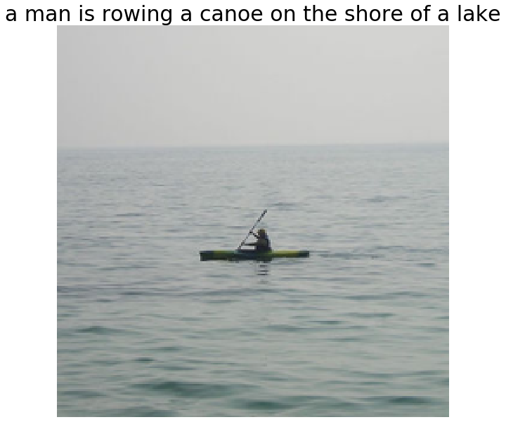

# Attention-Beam-Search-Image-Captioning

## Table of Contents
<center>

| No |   Title   |  
| :--- | :----------------------: | 
| 1. |   [Project Overview](#Project-Overview) |   
| 2. |   [Project Demo](#Project-Demo) |   
| 3. |[Datasets](#Datasets)|   
| 4.  |  [Methodology](#Methodology)  | 
| 5.  |    [Evaluation Metrics and Results](#Evaluation-Metrics-and-Results)   | 
| 6.  |    [Code Instructions](#Code-Instructions)   | 
| 7.  |    [Interpretation](#Interpretation)   | 
| 8.  |    [References](#References)   | 


</center>

## Project Overview

This project is done as a part of `Deep Learning Course` Course.
I implemented the following paper [**Show, Attend and Tell: Neural Image Caption Generation with Visual Attention**](https://arxiv.org/pdf/1502.03044.pdf) along with **Beam Search** and **Teacher Forcing** techniques for better captions.

We proposed an approach to solve the problem of **Image Captioning**. Image Captioning is simply the task to build a model that can generate a descriptive caption for an image we provide it.

                  Fig 1. Image Captioning Task 

<div align="center"></div>

<p>&nbsp;</p>

In this project, our aim is to generate an appropriate caption for given input image image. We used **Encoder-decoder Architecture** for this task along with **Attention**, **Beam Search**, and **Teacher Forcing** techniques to generate better captions.
Evaluation metrics such as **BLEU** and **METEOR** are used.  

Project Report can be found in [DL_Image_Captioning_Report.pdf](DL_Image_Captioning_Report.pdf ).


## Project Demo

                  Fig 2. Results  

<div align="center"></div>

<div align="center"></div>

<div align="center"></div>

<div align="center"></div>


<p>&nbsp;</p>

## Datasets 
- Visualization of example images from provided [dataset](https://drive.google.com/file/d/19MIw3ZI-Z91NLTDMc8GI4OlIOwN_Vv-t/view?usp=sharing).

                                   Fig 3. Dataset Images and Captions 

<div align="center">
 <table>
  <tr>
    <td>Image</td>
     <td>Captions</td>

  </tr>
  <tr>
    <td></td>
    <td></td>

  </tr>
  <tr>
    <td></td>
    <td></td>

  </tr>
  <tr>
    <td></td>
    <td></td>

  </tr>
 </table>
</div>
 

## Methodology
- **Encoder**
  &nbsp;
  The Encoder encodes the input image with 3 color channels into a smaller image with "learned" channels.
  We have used pre-trained **VGG-19** to encode the given image representation. Only features part of VGG-19 is used for feature extraction by removing last max pooling layer. Final image features obtained will be of shape (batch,flattened_feature_maps,channels).

- **Attention Model** 
  - Attention helps to choose only those parts of the encoding that it thinks is relevant to the task at hand.
  - Intuitively, it takes into account the sequence you have generated so far i.e. **previous hidden state of decoder** and so look at the image to decide what needs describing next.
  - Here,**soft Attention** is used where the weights of the pixels add up to 1. It can be thought as the probability that a pixel is the place to look to generate the next word. 

- **Decoder** 
  - The Decoder's job is to look at the encoded image and generate a caption word by word. A sequence is generated by using LSTM. 
  - Decoder uses **weighted (attention weights) average across all pixels**, with the weights of the important pixels being greater. This weighted representation of the image can be concatenated with the previously generated word at each step to generate the next word.

- **Teacher Forcing**
  - For generating better captions at each decoder step instead of providing previously generated word, we provide actual ground truth previous word at that decoder step. 
  - Performing teacher forcing ensures that if an incorrect word is generated at a time step in decoder it would not lead to further incorrect sequence because ground truth previous word is given as input to generate next word. 

- **Beam Search** 
  - Detailed explanation of beam search can be found [here](https://www.youtube.com/watch?v=RLWuzLLSIgw). 
  -  Intuition behind using beam search is that if we choose a word with the highest score and use it to predict the next word it may happen that the word may not lead to optimal solution, maybe choosing second best word would have lead to optimal solution.This follows for each word in the sequence has consequences for the ones that succeed it.
  - So, It would be best if we could somehow not decide until we've finished decoding completely, and choose the sequence that has the highest overall score from a basket of candidate sequences.
  - Beam Search does exactly this:- 

    - At the first decode step, consider the top k candidates.
    - Generate k second words for each of these k first words.
    - Choose the top k [first word, second word] combinations considering additive scores.
    - For each of these k second words, choose k third words, choose the top k [first word, second word, third word] combinations.
    - Repeat at each decode step.
    - After k sequences terminate, choose the sequence with the best overall score.
    - [read more](https://github.com/sgrvinod/a-PyTorch-Tutorial-to-Image-Captioning).

                        Fig 4. Complete Encoder-Decoder Architecture 

<div align="center"></div>


## Evaluation Metrics and Results

Following are the results of the project:


                             Fig 5. Results
   
  <div align="center">
  <table>
<tr><th>Validation Set Results</th><th>Test set results</th></tr>
<tr><td>

| METRIC    | SCORE |
| ----------- | ----------- |
| BLEU-1      | 0.6186      |
| BLEU-2    |    0.4211   |
| BLEU-3      |   0.2883    |
| BLEU-4      | 0.1909      |
| METEOR      |  0.4191     |


</td><td>

| METRIC    | SCORE |
| ----------- | ----------- |
| BLEU-1      | 0.6387   |
| BLEU-2    | 0.4393      |
| BLEU-3      |  0.3017   |
| BLEU-4      |  0.2031    |
| METEOR      |   0.4674   |


</td></tr> </table>
  </div>
   
   
   <div align="center">

<table>
  <tr>
    <td>IMAGES</td>
    
    
  </tr>
  <tr>
    </tr>
    <tr>
    <td></td>
  </tr>
    <tr>
    <td></td>
  </tr>
    <td></td>
  </tr>
    <tr>
    <td></td>

 </table> 
 
  </div> 


## Code Instructions

### Setup 
- Download the dataset from [here](https://drive.google.com/file/d/19MIw3ZI-Z91NLTDMc8GI4OlIOwN_Vv-t/view?usp=sharing).
- Preprocessed files for training model can be generated using [preprocessing.ipynb](preprocessing.ipynb) from the dataset given or downloaded from [here](https://drive.google.com/file/d/1WpQVe9xJZrO5uSAB_LzLHIflyoV0r1zL/view?usp=sharing).    
    - Following preprocessing has to be done before training :- 
      - **Preprpocessing captions** :- Removing punctuations, converting text to lower case and generating tokes. 
      - **word_map creation** :- Every word in the dictionary (training data) is mapped to a number (only words having count more than minimum frequency). Four special tokens are used to define start, beginning, unknown, padded - <start>, <eos>, <unk>,<pad>. These special tokens are mapped to value 0,1,2,3 respectively.
      - **word_map_reverse creation** :- Mapping from index to token simply reverse of word_map i.e index 0 has value <start>. 
      - Following lists are generated train_image_paths,
        train_image_captions, val_image_paths, val_image_captions, test_image_paths, test_image_captions which contain respective paths for images and their corresponding captions. Each word in caption is replaced by its numerical value in word_map and then stored.
        Captions may be of variable length so all are padded to a maximum length and token <start> and
        <end> placed at beginning and end. eg. 
         ```
        CAPTION : 
        <start> a black dog is running after a white dog in the snow <end> <pad> ....

        PROCESSED CAPTION FOR TRAINING :
        0,10,76,56,12,67,361,10,65,56,22,4,433,1,3,3,3,3,3,3,3,3,3,3,3,3,3,3,3,3,3,3,3,3,3
  
         ```
- Final trained model is present [here](final_model.pth).

## Usage 
- Generate all preprocessed files required for training.
- Change the arguments i.e path to preprocessed files here for training model. 
    - preprocessed_files is folder containing all preprocessed files for training.
    ```
    if __name__ == "__main__":

      args = myArgs(None,'./preprocessed_files',batch_size=64,epochs=25, lr=1e-3)
      main(args)

    ```
    - To test also mention the path to saved model like this. 
    ```
    args_test = myArgs('./model_saved_tf_vgg19_13.pth','./preprocessed_files/',batch_size=64,epochs=25, lr=1e-3)

    ```
    - To generate captions for an image also mention image path like this. 
    ```
        args = myArgs2(image_path, saved_model_path,preprocessed_files_folder_path, network='vgg19')
    ```

## Interpretation
- Teacher forcing and Beam search really improve the caption generation process and yield better performance. 
  


## References

1. [Pytoch Tutorial to Image Captioning](https://github.com/sgrvinod/a-PyTorch-Tutorial-to-Image-Captioning#overview%20https://github.com/AaronCCWong).
2. [Show Attend and Tell by Aaron Wong](https://github.com/AaronCCWong/Show-Attend-and-Tell).


 


